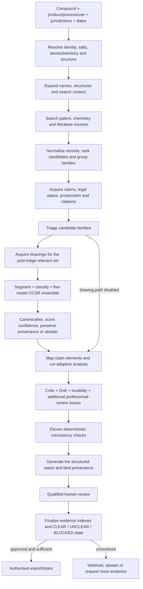
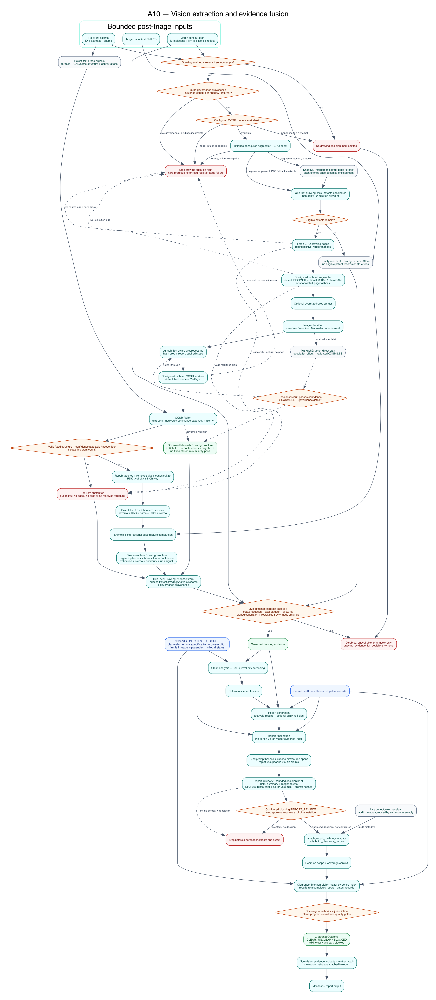
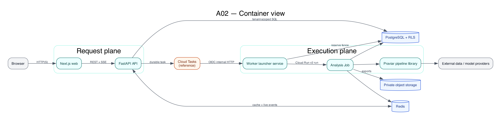
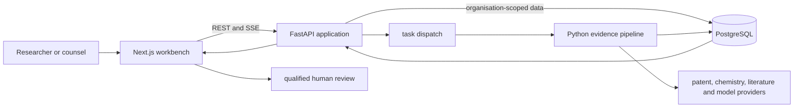

# Chemical Patent Analysis: Open-Source FTO Evidence Pipeline

A working, full-stack system for taking a chemical compound from structured
matter intake through patent retrieval, family grouping, claim-level evidence,
computer-vision extraction, deterministic verification, human review, and a
provenance-bearing report.

The repository combines a Next.js review workbench, FastAPI application,
asynchronous Python evidence pipeline, multi-source patent adapters, a
configurable five-model optical chemical structure recognition (OCSR)
ensemble, structured exports, selected evaluation tooling, and published
aggregate results.


> [!NOTE]
> This is a real capture of the working application. The visible compound,
> patent records, findings, counts, and timings use the bundled synthetic
> demonstration dataset. The original `Praviar` wordmark and internal package
> namespaces remain in the interface and source for compatibility.

## What has been built

- Compound intake by name, CAS, SMILES, InChI, or InChIKey, with product,
  process, use, jurisdiction, and timeframe scoping.
- Chemistry-aware query expansion and adapters for patent, chemistry,
  literature, prosecution, legal-status, and structure-search sources.
- Ranking, deduplication, family expansion, representative-publication
  selection, and source-health tracking.
- Adaptive claim analysis with exact source spans, uncertainty, prosecution
  context, critic review, Doctrine of Equivalents, and invalidity screening.
- Patent-drawing acquisition, segmentation, classification, five-model OCSR
  voting, RDKit normalisation, confidence gating, and explicit abstention.
- Eleven deterministic verification checks, evidence-sufficiency decisioning,
  and fail-closed export behaviour.
- Reviewer decisions, comments, audit events, sharing controls, REST endpoints,
  SSE progress, and role-aware PDF, DOCX, PPTX, XLSX, CSV, and JSON exports.

## Measured engineering results

The repository contains real evaluations on patent pages, chemical drawings,
and named pharmaceutical compounds—not only synthetic UI fixtures.

| Evaluation                      | Material and method                                                                                   | Measured result                                                                                           |
| ------------------------------- | ----------------------------------------------------------------------------------------------------- | --------------------------------------------------------------------------------------------------------- |
| Live page-to-structure pipeline | 128 real US patent pages; MolDet detection, classification, five-model OCSR, canonical-SMILES scoring | 1,035/1,069 annotated regions detected (96.8% recall); 62/86 labelled structures exact end to end (72.1%) |
| Live five-model OCSR benchmark  | 447 chemical-structure crops from 50 USPTO patents; no inference cache                                | 410/447 exact canonical matches (91.7%); 447/447 fused outputs valid                                      |
| Ensemble ablation               | 76 crops where all five voters were available                                                         | 81.6% exact for the ensemble versus 77.6% for the best individual model                                   |
| Multi-jurisdiction OCSR         | 358 scored rows / 355 unique images across CN, EU, JP, KR, and US patent material                     | 254/358 exact matches (70.95%)                                                                            |
| Patent-drawing detection        | 50 real US patent pages, 393 annotated boxes                                                          | 95.0% precision, 96.69% recall, 95.84% F1                                                                 |
| Real-compound retrieval sweep   | 50 named therapeutics across small molecules and biologics                                            | 49/50 completed; 17,584 deduplicated/ranked patent hits returned by Step 2                                |

Read the denominators, methodology, hashes, failure modes, and model-rights
boundaries in [Evaluation results](docs/evaluation/README.md). These measurements
demonstrate functioning engineering paths. They are not a counsel-adjudicated
legal-accuracy study, a guarantee of search completeness, or an SLA.

Stored end-to-end research runs also include named compounds such as
atorvastatin and osimertinib. Those runs demonstrate workflow execution from
input through report generation; they are not presented as independently
adjudicated legal conclusions.

> [!CAUTION]
> This software does not provide legal advice or a freedom-to-operate opinion.
> Qualified counsel must review the scope, sources, claims, status, dates,
> jurisdictions, assumptions, and underlying evidence before a commercial
> decision. Do not put confidential matters, credentials, personal data, or
> privileged material into an unreviewed deployment.

## Product tour

These are real screenshots of the running application using the bundled
synthetic “Example Molecule Alpha” matter. They show implemented interface
behaviour; the demonstration content itself is illustrative.

### Scope the compound and launch criteria


Compound identity, intended use, jurisdictions, sources, evidence path, and
the human handoff are visible before analysis begins.

### Follow every pipeline stage


The run-state interface exposes progress, current evidence, reconciliation,
provisional artefacts, and review gates rather than hiding work behind a
single spinner.

### Review the evidence dossier


The report brings together scope, patent families, claims, evidence,
uncertainty, reviewer state, watch controls, and export readiness.

### Drill from a claim element to its source


An exact claim element can be traced to the supporting passage and its source
record.

### Preserve qualified human decisions


Reviewers can accept, reject, or edit a finding and preserve their rationale
separately from model-assisted analysis.

### Withhold output when evidence is not ready


Export is blocked when evidence, source, jurisdiction, or reviewer gates remain
unresolved.

### See the role-aware capability map


The in-product atlas connects compound research, claim evidence, review, and
handoff capabilities to counsel, founder, operations, and diligence workflows.
See [all 14 desktop and mobile product captures](docs/product-tour/README.md).

## Compound-to-report pipeline



| Stage                           | What the implementation does                                                                                                                                 | Primary code                                                                                                                                                                                                                                                                                                                                             |
| ------------------------------- | ------------------------------------------------------------------------------------------------------------------------------------------------------------ | -------------------------------------------------------------------------------------------------------------------------------------------------------------------------------------------------------------------------------------------------------------------------------------------------------------------------------------------------------- |
| 1. Matter and identity          | Validates the requested compound and accused product/process/use; resolves structures, salts, biologics, identifiers, and ambiguity requiring review         | [`step1_resolve.py`](praviar_pipeline/src/praviar_pipeline/pipeline/step1_resolve.py), [`identity_review.py`](praviar_pipeline/src/praviar_pipeline/pipeline/identity_review.py)                                                                                                                                                                         |
| 2. Search context and retrieval | Expands names and structures, runs configured source adapters, records attempts and source health, and preserves provider provenance                         | [`step2_search.py`](praviar_pipeline/src/praviar_pipeline/pipeline/step2_search.py), [`search/orchestration.py`](praviar_pipeline/src/praviar_pipeline/pipeline/search/orchestration.py)                                                                                                                                                                 |
| 3. Ranking and patent families  | Blends relevance signals, deduplicates publications, expands families, selects representatives, and enriches authoritative records                           | [`ranking/pipeline.py`](praviar_pipeline/src/praviar_pipeline/pipeline/ranking/pipeline.py), [`step2c_families.py`](praviar_pipeline/src/praviar_pipeline/pipeline/step2c_families.py)                                                                                                                                                                   |
| 4. Candidate triage             | Conservatively separates relevant, possibly relevant, and unsupported material while retaining reasons and uncertainty                                       | [`step3_triage.py`](praviar_pipeline/src/praviar_pipeline/pipeline/step3_triage.py)                                                                                                                                                                                                                                                                      |
| 5. Claim and drawing evidence   | Runs drawing acquisition and OCSR on the post-triage relevant set, then maps claim elements using the available text and governed drawing evidence           | [`step2d_drawings.py`](praviar_pipeline/src/praviar_pipeline/pipeline/step2d_drawings.py), [`ocsr/ensemble.py`](praviar_pipeline/src/praviar_pipeline/ocsr/ensemble.py), [`step4_analyze.py`](praviar_pipeline/src/praviar_pipeline/pipeline/step4_analyze.py)                                                                                           |
| 6. Additional issue analysis    | Escalates difficult matters and runs the portfolio critic, prosecution, Doctrine of Equivalents, and invalidity paths                                        | [`step4b_critic.py`](praviar_pipeline/src/praviar_pipeline/pipeline/step4b_critic.py), [`step5_doe.py`](praviar_pipeline/src/praviar_pipeline/pipeline/step5_doe.py), [`step6_invalid.py`](praviar_pipeline/src/praviar_pipeline/pipeline/step6_invalid.py)                                                                                              |
| 7. Deterministic verification   | Runs all 11 configured consistency checks and records every pass, failure, unavailable check, and vacuous-pass severity before report generation             | [`step7_verify.py`](praviar_pipeline/src/praviar_pipeline/pipeline/step7_verify.py), [`verification/`](praviar_pipeline/src/praviar_pipeline/pipeline/verification/)                                                                                                                                                                                     |
| 8. Report, review, and decision | Generates and provenance-binds the dossier, runs the report-review checkpoint, finalises evidence-sufficiency state, and authorises or withholds each export | [`step8_report.py`](praviar_pipeline/src/praviar_pipeline/pipeline/step8_report.py), [`report_review.py`](praviar_pipeline/src/praviar_pipeline/pipeline/runtime/report_review.py), [`decisioning.py`](praviar_pipeline/src/praviar_pipeline/pipeline/runtime/decisioning.py), [`export_authorization.py`](api/src/api/services/export_authorization.py) |

The full execution narrative is in [Pipeline technical documentation](docs/PIPELINE.md)
and the [runtime phase map](docs/architecture/src/09-runtime-phase-map.md).

## Vision and OCSR path



The implemented path separates drawing extraction from decision influence:

1. Obtain patent page images and drawing references.
2. Detect chemical regions and retain location/provenance.
3. Classify molecule, Markush, reaction, graph, and unsupported regions.
4. Route supported crops to configured MolScribe, MolSight, DECIMER,
   MolNexTR, and MolGrapher workers.
5. Parse and RDKit-canonicalise each candidate.
6. Fuse candidates using confidence cascade, majority vote, weighted majority,
   or best-single strategies.
7. Apply confidence, heavy-atom, stereo, calibration, and provenance gates.
8. Admit resolved drawing evidence or explicitly abstain/retain it for review.

Model weights are not distributed in this repository. Model-specific licences
and the non-commercial MolDet boundary are documented in
[MODEL_LICENSES.md](MODEL_LICENSES.md).

## Run the interface locally

You need Git, Node.js 20 or newer, and Corepack. The bundled interface tour is
deterministic and needs no account, database, provider credential, or model
weight. It is separate from the provider-backed pipeline described above.

```bash
git clone https://github.com/Peter-McCann-Strain/chemical-patent-analysis.git
cd chemical-patent-analysis
corepack enable
pnpm install --frozen-lockfile
pnpm demo
```

Open:

| Route                                                                                                   | Working view                                             |
| ------------------------------------------------------------------------------------------------------- | -------------------------------------------------------- |
| [`/`](http://localhost:3000/)                                                                           | Product entry point                                      |
| [`/sample-reports/example-molecule-alpha`](http://localhost:3000/sample-reports/example-molecule-alpha) | Synthetic evidence dossier                               |
| [`/analyses/new`](http://localhost:3000/analyses/new)                                                   | Compound and matter intake                               |
| [`/analyses/ana_demo_001/report`](http://localhost:3000/analyses/ana_demo_001/report)                   | Report, claims, citations, uncertainty, and review state |
| [`/reviews`](http://localhost:3000/reviews)                                                             | Reviewer queue                                           |
| [`/capabilities`](http://localhost:3000/capabilities)                                                   | In-product capability and workflow map                   |

Stop the server with `Ctrl+C`. See [Getting started](docs/getting-started.md)
for troubleshooting.

## Architecture





The [architecture index](docs/architecture/README.md) contains system,
container, sequence, evidence-pipeline, data, trust-boundary, deployment,
runtime, and vision views.

## Repository map

| Path                         | Purpose                                                                       |
| ---------------------------- | ----------------------------------------------------------------------------- |
| `web/`                       | Next.js workbench, review experience, and local product tour                  |
| `api/`                       | FastAPI application, workers, persistence, review, sharing, and exports       |
| `praviar_pipeline/`          | Chemistry, retrieval, OCSR, claim analysis, verification, and report pipeline |
| `packages/shared-types/`     | Generated TypeScript contracts                                                |
| `packages/showcase-fixture/` | Canonical synthetic interface dataset                                         |
| `research/`                  | Selected benchmark, scoring, and validation tooling                           |
| `infra/terraform/`           | GCP infrastructure reference modules                                          |
| `docs/`                      | Product tour, evaluation, pipeline, architecture, setup, and limitations      |

Start with the [documentation index](docs/README.md).

## Project and legal status

This is an active, best-effort open-source research project and engineering
portfolio. The code implements the full system and includes measured
engineering evaluations; this repository does not include a hosted service,
commercial patent-data licences, redistributed model weights, an uptime
commitment, or a support SLA.

The important technical and evaluation boundaries are collected in
[Known limitations](docs/limitations.md). Security-sensitive reports should
follow [SECURITY.md](SECURITY.md). Issues and pull requests are welcome under
[CONTRIBUTING.md](CONTRIBUTING.md), although response times are not guaranteed.

## Licence and third-party material

Project-authored code and documentation are provided under
[Apache-2.0](LICENSE). The licence does not relicense third-party dependencies,
patent documents, datasets, model weights, APIs, or trademarks.

Review [third-party notices](THIRD_PARTY_NOTICES.md),
[model terms](MODEL_LICENSES.md), [asset terms](ASSET_LICENSES.md), and the
[trademark policy](TRADEMARKS.md) before redistribution or deployment.
