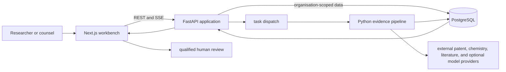

# Praviar

Praviar is an unsupported research archive of a counsel-supervised workflow for
small-molecule patent-evidence review. The source demonstrates chemistry-aware
retrieval, patent-family triage, claim-level evidence mapping, explicit
uncertainty, human review, and structured reporting.

The repository is published so its engineering ideas can be inspected,
studied, and adapted. It is not presented as a production service.

> [!CAUTION]
> Praviar is research software, not legal advice, a freedom-to-operate opinion,
> or a guarantee of non-infringement. It does not replace qualified counsel or
> specialist patent databases. Do not enter confidential compounds, invention
> disclosures, client matters, personal data, or credentials into this code or
> its synthetic demo.

## Try the fictional demo

You need Git, Node.js 20 or newer, and Corepack. The demo uses a bundled,
schema-validated fictional matter. It does not start the API, query patent
sources, call a model, or require an account, database, or provider key.

```bash
git clone https://github.com/Peter-McCann-Strain/praviar-open-source.git
cd praviar-open-source
corepack enable
pnpm install --frozen-lockfile
pnpm demo
```

Then open these local routes:

| Route                                                                                                   | What it shows                                                     |
| ------------------------------------------------------------------------------------------------------- | ----------------------------------------------------------------- |
| [`/`](http://localhost:3000/)                                                                           | Archive overview and product entry point                          |
| [`/sample-reports/example-molecule-alpha`](http://localhost:3000/sample-reports/example-molecule-alpha) | Fictional example dossier                                         |
| [`/analyses/new`](http://localhost:3000/analyses/new)                                                   | Structured matter intake and scope review                         |
| [`/analyses/ana_demo_001/report`](http://localhost:3000/analyses/ana_demo_001/report)                   | Evidence report, claims, citations, uncertainty, and review state |

The fictional review queue is at
[`/reviews`](http://localhost:3000/reviews), and the in-product capability
boundary is at [`/capabilities`](http://localhost:3000/capabilities). Stop the
server with `Ctrl+C`.

See [Getting started](docs/getting-started.md) if the first run does not work.

## What is in the archive

| Surface             | Included                                                                                                             | Important boundary                                                           |
| ------------------- | -------------------------------------------------------------------------------------------------------------------- | ---------------------------------------------------------------------------- |
| Synthetic interface | Intake, dossier, report, citation, review, sharing, and export states                                                | Fictional fixtures do not prove a live analysis or correct legal outcome     |
| Application API     | REST/SSE clients, asynchronous analysis lifecycle, scoped API-key/JWT paths, review workflow, and structured exports | No hosted availability, latency, backup, or service-level claim              |
| Evidence pipeline   | Public-source adapters, chemistry context, family grouping, claim analysis, consistency checks, and abstention paths | No complete or commercially equivalent patent-source coverage                |
| Tenant boundaries   | Organisation-scoped data paths, authorisation checks, row-level-security support, and audit-oriented events          | No penetration-test, certification, or secure-deployment claim               |
| Vision and models   | Configurable drawing/OCSR orchestration, confidence checks, and shadow/experimental paths                            | No model weights, validated Markush interpretation, or redistribution rights |
| Infrastructure      | Local development assets and a GCP reference topology                                                                | Unvalidated reference design, not a deployment recipe or guarantee           |
| Evaluation tooling  | Schemas, synthetic cases, benchmark runners, and failure-preserving records                                          | No public, independently adjudicated legal-accuracy result                   |

An adapter or infrastructure file shows an integration path in code. It does
not include upstream access, a data licence, a configured environment, or
operational assurance.

## Eight-stage workflow

Praviar presents the workflow as eight reviewable stages:

1. Define the compound and intended product, process, use, jurisdictions, and
   timeframe.
2. Resolve chemical identity and build the search context.
3. Retrieve, normalise, rank, and group candidate patent families.
4. Triage potentially relevant material for structured review.
5. Map claim-level evidence, citations, and uncertainties.
6. Screen additional issues that require professional judgement.
7. Run deterministic consistency checks and fail or abstain when required
   evidence is missing.
8. Build a structured report for qualified human review.

The implementation has finer internal checkpoints. Model output, structure
similarity, and source ranking remain evidence inputs; they are not legal claim
construction. The detailed implementation is documented in
[the pipeline reference](docs/PIPELINE.md) and
[the runtime phase map](docs/architecture/src/09-runtime-phase-map.md).

## Architecture at a glance



The [architecture index](docs/architecture/README.md) contains system,
container, sequence, data, trust-boundary, deployment-profile, runtime, and
vision views. Deployment and operations material describes unvalidated
reference designs only.

## Repository map

| Path                         | Purpose                                                                 |
| ---------------------------- | ----------------------------------------------------------------------- |
| `web/`                       | Next.js workbench and fictional local showcase                          |
| `api/`                       | FastAPI application, workers, persistence, review, sharing, and exports |
| `praviar_pipeline/`          | Chemistry and patent-evidence research pipeline                         |
| `packages/shared-types/`     | Generated TypeScript contracts                                          |
| `packages/showcase-fixture/` | Canonical fictional showcase matter                                     |
| `research/`                  | Selected benchmark and validation tooling; not runtime code             |
| `infra/terraform/`           | Unvalidated GCP infrastructure reference                                |
| `docs/`                      | Getting-started, limitations, pipeline, and architecture documentation  |

Start with the [documentation index](docs/README.md). The most important
constraints are collected in [Known limitations](docs/limitations.md).

## Project status

- Unsupported, best-effort research archive.
- No production build, hosted service, uptime commitment, service level, or
  support response time is offered.
- No public benchmark establishes legal accuracy, search completeness, or a
  false-clear rate.
- Issues and pull requests may be opened, but maintenance and review are not
  guaranteed.

Security-sensitive reports should follow [SECURITY.md](SECURITY.md). General
participation guidance is in [CONTRIBUTING.md](CONTRIBUTING.md), with project
support boundaries in [SUPPORT.md](SUPPORT.md).

## Licence and third-party material

Praviar-authored code and documentation are provided under
[Apache-2.0](LICENSE). The licence does not relicense third-party dependencies,
patent documents, datasets, model weights, media, APIs, or trademarks. Model
weights and downloaded patent corpora are not included.

Before reusing or redistributing the archive, review
[third-party notices](THIRD_PARTY_NOTICES.md),
[model terms](MODEL_LICENSES.md), [asset terms](ASSET_LICENSES.md), and the
[trademark policy](TRADEMARKS.md). Contributions are described in
[CONTRIBUTING.md](CONTRIBUTING.md).
