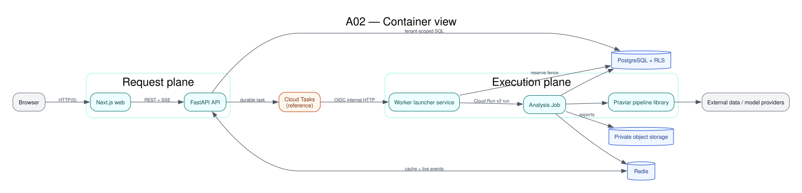
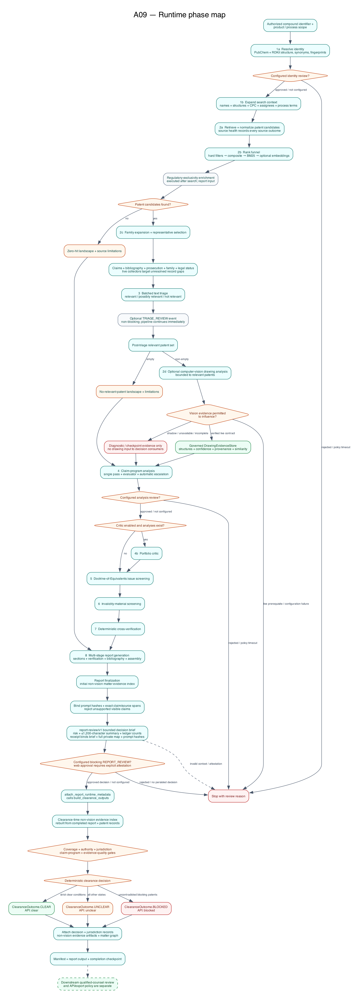

# Architecture

Praviar is a modular research system for counsel-supervised patent-evidence triage. The diagrams in this directory describe implemented boundaries and the intended hosted topology; they do not assert that a particular public deployment exists or has passed operational assurance.

The Mermaid blocks are the canonical, GitHub-readable design sources. Static SVG and PNG companions are included for renderers that do not support Mermaid. They are explanatory reference material, not runtime or deployment evidence.

## Diagram index

| ID  | View                                                                      | Static export                                                                                   | Question answered                                                                                                                       |
| --- | ------------------------------------------------------------------------- | ----------------------------------------------------------------------------------------------- | --------------------------------------------------------------------------------------------------------------------------------------- |
| A01 | [System context](src/01-system-context.md)                                | [SVG](rendered/a01-system-context.svg) · [PNG](rendered/a01-system-context.png)                 | Who uses Praviar and which external systems sit outside its control?                                                                    |
| A02 | [Container view](src/02-container-view.md)                                | [SVG](rendered/a02-container-view.svg) · [PNG](rendered/a02-container-view.png)                 | How do the web, API, worker, stores, and providers interact?                                                                            |
| A03 | [Analysis sequence](src/03-analysis-sequence.md)                          | [SVG](rendered/a03-analysis-sequence.svg) · [PNG](rendered/a03-analysis-sequence.png)           | What happens from submission through review and export?                                                                                 |
| A04 | [Evidence pipeline](src/04-evidence-pipeline.md)                          | [SVG](rendered/a04-evidence-pipeline.svg) · [PNG](rendered/a04-evidence-pipeline.png)           | Where do adaptive escalation, verification, and abstention occur?                                                                       |
| A05 | [Trust boundaries](src/05-trust-boundaries.md)                            | [SVG](rendered/a05-trust-boundaries.svg) · [PNG](rendered/a05-trust-boundaries.png)             | Where do tenant data, credentials, and provider egress cross boundaries?                                                                |
| A06 | [Core data model](src/06-core-data-model.md)                              | [SVG](rendered/a06-core-data-model.svg) · [PNG](rendered/a06-core-data-model.png)               | Which entities carry the core analysis and review lifecycle?                                                                            |
| A07 | [Deployment profiles](src/07-deployment-profiles.md)                      | [SVG](rendered/a07-deployment-profiles.svg) · [PNG](rendered/a07-deployment-profiles.png)       | How does the synthetic local profile differ from the hosted reference?                                                                  |
| A09 | [Runtime phase map](src/09-runtime-phase-map.md)                          | [SVG](rendered/a09-runtime-phase-map.svg) · [PNG](rendered/a09-runtime-phase-map.png)           | What happens in each implemented pipeline phase and where do review or evidence gates intervene?                                        |
| A10 | [Vision extraction and evidence fusion](src/10-vision-evidence-fusion.md) | [SVG](rendered/a10-vision-evidence-fusion.svg) · [PNG](rendered/a10-vision-evidence-fusion.png) | How does drawing evidence reach analysis and report fields while non-vision records separately drive post-review clearance decisioning? |

## Pipeline implementation views

The Graphviz sources in [`graphviz/`](graphviz/) are deliberately small static companions, not a second architectural specification. Anyone modifying an architecture view should update its Mermaid source, Graphviz companion, and static previews together.

## Runtime boundaries

| Boundary                 | Responsibility                                                                                                |
| ------------------------ | ------------------------------------------------------------------------------------------------------------- |
| `web/`                   | User interface, local synthetic fixtures, REST/SSE clients, review and export controls                        |
| `api/`                   | Authentication/authorization, tenant scoping, persistence, dispatch, streaming, sharing, export orchestration |
| `praviar_pipeline/`      | Compound resolution, retrieval, ranking, analysis, verification, and report construction                      |
| `packages/shared-types/` | Generated TypeScript representation of Python report contracts                                                |
| `research/`              | Benchmarks, experiments, conversion tools, and validation material; never imported as production runtime data |
| `infra/terraform/`       | Unvalidated hosted-infrastructure reference; not proof of a live or certified deployment                      |

## Invariants

- Tenant-owned reads and writes are scoped by `org_id`; PostgreSQL row-level security is a defence-in-depth boundary, not a substitute for service authorization.
- `APP_ENV` and `NEXT_PUBLIC_DEMO_MODE` are explicit. Missing production configuration does not silently select demo behavior.
- Pipeline and API schemas are Pydantic contracts; shared TypeScript types are generated rather than hand-edited.
- Progress is persisted as pipeline events and streamed with SSE; Redis provides live delivery while PostgreSQL supports replay.
- Production dispatch is designed for Cloud Tasks with OIDC to a short-lived worker launcher, which reserves an execution fence and starts a separate Cloud Run analysis Job. Local development may use its documented alternative.
- Optional model or vision evidence is withheld from decision influence when configured prerequisites, provenance, or integrity checks are absent; hard runtime failures and per-item abstentions follow the explicit paths in A09 and A10.
- A generated report is a review artefact. Human review and provenance do not turn it into legal advice or prove its accuracy.

## Related decisions

- [ADR-001: runtime and research boundaries](adr-001-repo-boundaries.md)
- [ADR-002: explicit environment contract](adr-002-environment-contract.md)
- [ADR-003: generated contracts](adr-003-contract-generation.md)
- [Detailed pipeline reference](../PIPELINE.md)
- [Known limitations](../limitations.md)

## Keeping diagrams truthful

Any change to service boundaries, dispatch, persistence, pipeline stages, trust boundaries, or core relationships must update the corresponding source and static companion in the same change. Diagram labels distinguish `implemented`, `optional`, `reference`, and `external` behavior where confusion would be material. A diagram must not be used as release evidence by itself.

The static companions reflect a point-in-time rendering of the source views. The archive does not claim a current deterministic render or independent architecture validation.
