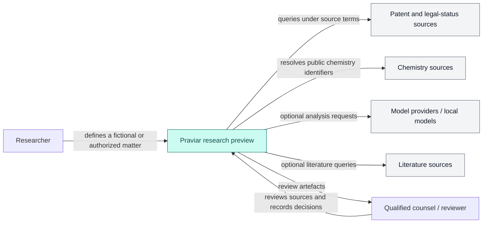

# A01 — System context

The system organizes evidence for a researcher or qualified reviewer. Source publishers and model providers remain independent systems with their own availability, terms, and accuracy limits.

Out of scope: independently verified legal accuracy, unpublished applications, universal jurisdiction coverage, and any guarantee that retrieved evidence is complete or current.
