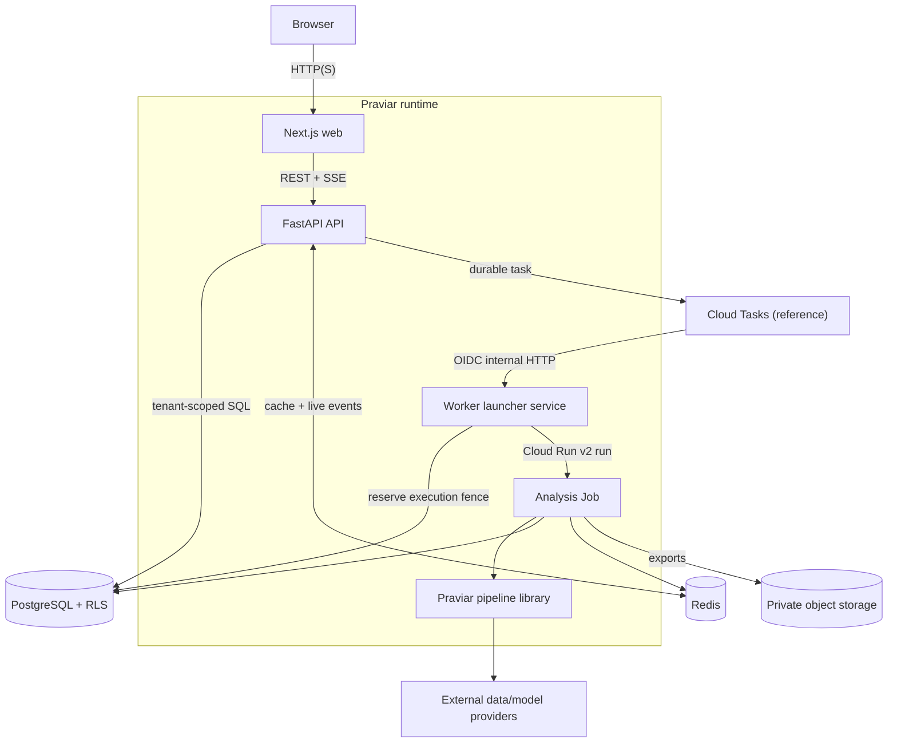

# A02 — Container view

The local synthetic profile needs only the web container. The other containers describe the full application and hosted reference. The worker service is a short control-plane launcher; the long-running pipeline executes in a separate analysis Job.

`Cloud Tasks`, Cloud Run Jobs, hosted object storage, and the deployment shape are reference integrations. Their source code does not prove a deployed service or operational SLA.
