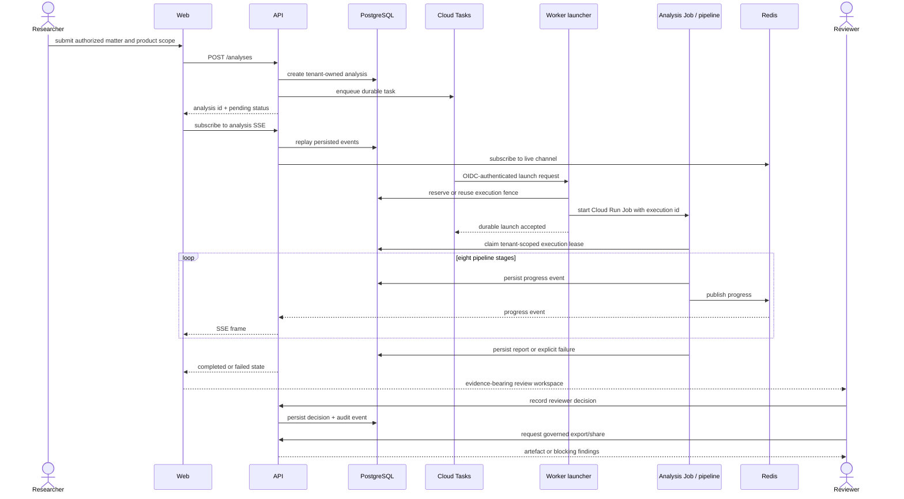

# A03 — Analysis sequence

The synthetic demo replays fixtures in the web application and does not execute this queue, launcher, Job, provider, or persistence sequence.

Pipeline resume checkpoints are signed files in configured runtime storage; they are not represented as PostgreSQL rows in this view. Human checkpoint decisions and progress events are persisted separately by the API.
