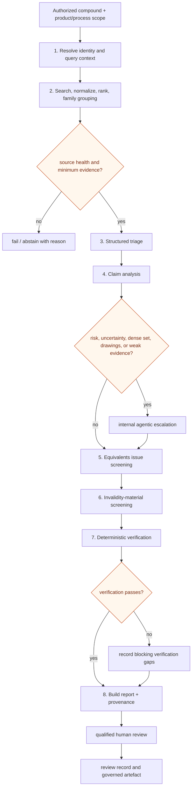

# A04 — Evidence pipeline

OCR/OCSR, structure similarity, retrieval scores, and model output are evidence inputs—not claim construction or a legal conclusion. Markush interpretation remains a material experimental limitation.

Failed deterministic checks remain visible in the report and downstream evidence directives, but block a positive clearance output until resolved; they do not disappear merely because a report artefact can still be assembled.
