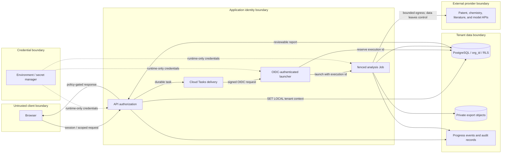

# A05 — Trust boundaries

Public examples must be fictional. A public demo must not accept confidential uploads. Hashes and signatures demonstrate integrity relative to recorded inputs; they do not establish source truth, legal sufficiency, or trustworthy model behavior.
