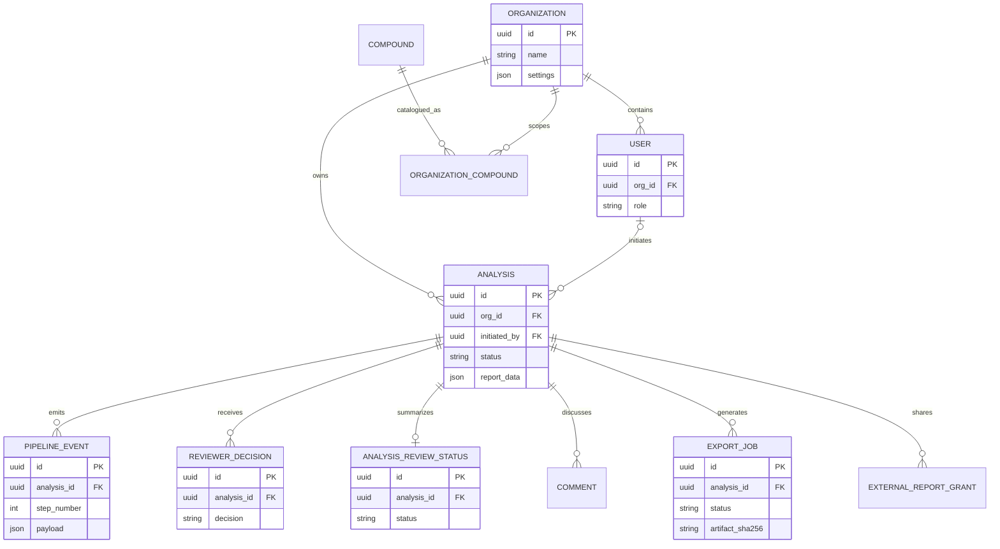

# A06 — Core data model

This is the review-critical subset, not every operational table. The ORM remains authoritative.

Tenant isolation applies to tenant-owned records even when a foreign key already points to an analysis. Relationships and columns change more frequently than this overview; consult `api/src/api/db/models_*.py` and migrations before implementing against the schema.
