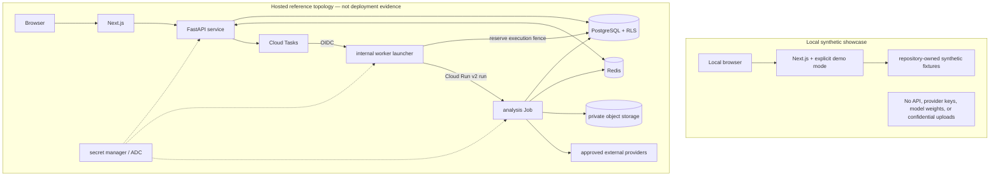

# A07 — Deployment profiles

The local profile is the portfolio entry point. The hosted topology requires environment-specific IAM, data-protection, monitoring, backup, incident-response, penetration-testing, and release evidence that source code alone cannot supply.
