# A09 — Runtime phase map

```mermaid
flowchart TB
    I["Authorized compound identifier + product/process scope"] --> R["1a. Resolve identity<br/>PubChem + RDKit structure, synonyms, fingerprints"]
    R --> HI{"configured identity review"}
    HI -->|"approved or not configured"| Q["1b. Expand search context<br/>names, structures, CPC, assignees, process terms"]
    HI -->|"rejected / timed out by policy"| STOP["stop with review reason"]

    Q --> S["2a. Retrieve + normalize patent candidates<br/>source health records every success and failure"]
    S --> RK["2b. Rank funnel<br/>hard filters → composite → BM25 → optional embeddings"]
    RK --> REG["regulatory-exclusivity enrichment<br/>executed after search; result is a report input"]
    REG --> HP{"patent candidates found?"}
    HP -->|"no"| NOHIT["record zero-hit landscape + source limitations"]
    HP -->|"yes"| F["2c. Family expansion + representative selection"]
    F --> E["Claims, bibliography, prosecution, family and legal-status enrichment<br/>live collectors target unresolved record gaps"]

    E --> T["3. Batched text triage<br/>relevant / possibly relevant / not relevant"]
    T --> HT["optional TRIAGE_REVIEW event<br/>non-blocking; pipeline continues immediately"]
    HT --> RP["post-triage relevant patent set"]
    RP -->|"empty"| EMPTY["record no-relevant-patent landscape + limitations"]

    RP -->|"non-empty"| V["2d. Optional computer-vision drawing analysis<br/>bounded to the relevant set"]
    V --> VG{"vision evidence permitted to influence?"}
    VG -->|"shadow, unavailable, or gate incomplete"| VH["retain diagnostic/checkpoint evidence only<br/>pass no drawing evidence to decision consumers"]
    VG -->|"live rollout + verified evidence contract"| VE["governed DrawingEvidenceStore<br/>structures, confidence, provenance, similarity"]
    VG -->|"live prerequisite/configuration failure"| STOP
    EMPTY --> A["4. Claim-program analysis<br/>single pass + evaluator + automatic agentic escalation"]
    VH --> A
    VE --> A

    A --> HA{"configured analysis review"}
    HA -->|"approved or not configured"| CG{"critic enabled and analyses exist?"}
    HA -->|"rejected / timed out by policy"| STOP
    CG -->|"yes"| C["4b. Portfolio critic"]
    CG -->|"no"| D["5. Doctrine-of-Equivalents issue screening"]
    C --> D["5. Doctrine-of-Equivalents issue screening"]
    D --> N["6. Invalidity-material screening"]
    N --> X["7. Deterministic cross-verification"]

    X --> P["8. Multi-stage report generation<br/>sections, verification, bibliography, assembly"]
    NOHIT --> P
    P --> PI["report finalization<br/>initial non-vision matter evidence index"]
    PI --> BIND["bind prompt hashes + exact claim/source spans<br/>reject unsupported visible claims"]
    BIND --> BR["report-review/v1 bounded decision brief<br/>risk + ≤1,200-character summary + ledger counts<br/>receipt binds brief + full private map + prompt hashes"]
    BR -.->|"invalid context or source-span attestation"| STOP
    BR --> HR{"configured blocking REPORT_REVIEW<br/>web approval requires explicit attestation"}
    HR -->|"approved decision or not configured"| M["attach_report_runtime_metadata<br/>calls build_clearance_outputs"]
    HR -->|"rejected or no persisted decision"| STOP
    M --> CI["clearance-time non-vision evidence index<br/>rebuilt from completed report + patent records"]
    CI --> CGT["coverage + authority + jurisdiction<br/>claim-program and evidence-quality gates"]
    CGT --> G{"deterministic clearance decision"}
    G -->|"strict clear conditions all pass"| CL["ClearanceOutcome.CLEAR<br/>API: clear"]
    G -->|"blocking patents without authoritative contradiction"| BL["ClearanceOutcome.BLOCKED<br/>API: blocked"]
    G -->|"all other states, including insufficient evidence"| UN["ClearanceOutcome.UNCLEAR<br/>API: unclear"]
    CL --> MA["attach decision + jurisdiction records<br/>non-vision evidence artifacts + matter graph"]
    BL --> MA
    UN --> MA
    MA --> W["manifest + report output + completion checkpoint"]
    W -.-> H["downstream qualified-counsel review<br/>and API/export policy are separate"]

    classDef guard fill:#fff7ed,stroke:#c2410c,color:#7c2d12;
    classDef withheld fill:#fef2f2,stroke:#b91c1c,color:#7f1d1d;
    classDef governed fill:#ecfdf5,stroke:#15803d,color:#14532d;
    class HI,VG,HA,HR,CGT,G guard;
    class STOP,VH,BL withheld;
    class VE,CL,H governed;
```

The numbered labels preserve the public eight-step vocabulary while showing the actual runtime ordering. Regulatory enrichment completes after search and before family expansion; when patent candidates exist, family, claims, bibliography and live evidence collection happen before triage. Drawing analysis is deliberately delayed until after triage so image retrieval is bounded to the relevant set. Identity, analysis and report review are blocking only when configured (identity review may also be required by identity policy); `TRIAGE_REVIEW` is explicitly non-blocking. A zero-hit search proceeds directly to report construction, while an empty post-triage relevant set still traverses the empty analysis, review, issue-screening and verification stages.

Report finalization first builds an initial non-vision `MatterEvidenceIndex`. The runtime then binds prompt hashes and the exact `ClaimSourceSpanMap`, rejects unsupported customer-visible claims, and constructs a bounded `report-review/v1` decision brief. That brief exposes identifiers, upstream risk, patent and analysis-failure counts, an executive-summary excerpt of at most 1,200 characters plus its truncation flag, aggregate claim-ledger counts and attestation-key IDs, and a prompt-hash count. It does **not** expose the full `FTOReport`, full private source-span map, source excerpts, evidence HMAC receipts, or individual prompt-hash values. Its SHA-256 receipt binds the bounded decision brief, the complete private claim/source-span map, and the complete sorted prompt-hash map; the digest then forms part of the checkpoint ID. Invalid context or verified-claim source-span attestations stop before review. When the checkpoint is configured, the web gate displays the bounded risk, excerpt, ledger metrics, disclosed failures and receipt; malformed or unsupported context cannot be approved, and web approval requires an explicit reviewer attestation whose persisted note carries the full digest.

Only after an approved checkpoint decision (or when that checkpoint is not configured) does `attach_report_runtime_metadata` call `build_clearance_outputs`. The review is therefore not a review of the later clearance outcome or a full final-report content review. The clearance pass rebuilds the non-vision index, computes coverage and gates, determines the top-line outcome, and assembles the evidence artifacts, matter graph and jurisdiction records before manifest construction and output writing. The enum members `CLEAR`, `UNCLEAR`, and `BLOCKED` serialize through the API as `clear`, `unclear`, and `blocked`. Missing, conflicting, stale or insufficiently authoritative evidence ordinarily prevents `CLEAR` and yields `UNCLEAR`; `BLOCKED` is reserved for blocking patents without an authoritative-record contradiction. All three are report outputs, not synonyms for pipeline success or export approval.

## Implementation anchors

| Runtime phase | Primary implementation | Contract carried forward |
| --- | --- | --- |
| Bootstrap and resume | `run.py`, `pipeline/runtime/flow_bootstrap.py`, `pipeline/runtime/checkpoints.py` | Task-local validated settings, run identity, deterministic seed, compatible checkpoint state |
| Identity and query context | `pipeline/step1_resolve.py`, `pipeline/identity_review.py`, `pipeline/step1b_expand.py` | `ResolvedCompound`, identity-review context, `ExpandedSearchQueries` |
| Retrieval and ranking | `pipeline/step2_search.py`, `pipeline/ranking/pipeline.py`, `pipeline/search_loop.py` | Deduplicated `PatentHit` records, `SourceHealth`, ranking funnel and optional search-loop audit |
| Family and authoritative enrichment | `pipeline/step2c_families.py`, `pipeline/runtime/search_enrichment.py`, `pipeline/runtime/live_collectors.py` | Claims, bibliography, family, prosecution and legal-status records plus collector attempts |
| Text triage | `pipeline/step3_triage.py`, `pipeline/runtime/run_execution.py`, `pipeline/checkpoints.py` | All triage decisions, filtered relevant set, token/failure audit and an optional non-blocking review event |
| Drawing analysis | `pipeline/step2d_drawings.py`, `pipeline/drawings/`, `pipeline/drawing_rollout.py` | Optional `DrawingEvidenceStore`; only a verified live store is passed to decision consumers |
| Claim and issue analysis | `pipeline/step4_analyze.py`, `pipeline/runtime/post_analysis.py` | Claim-level analyses, escalation reasons, critic findings, DoE and invalidity assessments |
| Verification and report | `pipeline/step7_verify.py`, `pipeline/step8_report.py`, `pipeline/report/finalization.py`, `pipeline/runtime/flow_finalize.py`, `pipeline/runtime/report_review.py` | Deterministic checks, report draft, initial non-vision matter evidence index, audit trail, prompt hashes, exact claim/source-span map, integrity-bound bounded review brief and optional blocking report review |
| Evidence decisioning | `pipeline/runtime/flow_helpers.py`, `pipeline/runtime/decisioning.py`, `pipeline/runtime/matter_graph_state.py`, `pipeline/report/evidence_index.py` | Post-review clearance-time index rebuild, matter graph, coverage metrics, jurisdiction decisions, `CLEAR`/`UNCLEAR`/`BLOCKED`, and opinion-readiness metadata |
