# A10 — Vision extraction and evidence fusion

```mermaid
flowchart TB
    subgraph Inputs["Bounded post-triage inputs"]
        P["relevant patents<br/>ID, abstract, claims"]
        T["target canonical SMILES"]
        C["vision configuration<br/>jurisdictions, limits, tools, rollout"]
    end

    P --> EL{"drawing enabled and relevant set non-empty?"}
    C --> EL
    EL -->|"no"| NR["no drawing decision input emitted"]
    EL -->|"yes"| PROV{"build governance provenance<br/>influence-capable or shadow/internal?"}
    PROV -->|"live governance or bindings incomplete"| FAIL["stop drawing analysis / run<br/>hard prerequisite or required live-stage failure"]
    PROV -->|"valid"| RUN{"configured OCSR runners available?"}
    RUN -->|"none; influence-capable"| FAIL
    RUN -->|"none; shadow/internal"| NR
    RUN -->|"available"| SETUP["initialize configured segmenter + EPO client"]
    SETUP -->|"missing in influence-capable run"| FAIL
    SETUP -->|"shadow/internal segmenter absent"| FULL["select full-page segmentation fallback<br/>each fetched page becomes one segment"]
    SETUP -->|"segmenter present<br/>(shadow source may use PDF fallback)"| SELECT["take first drawing_max_patents candidates<br/>then apply jurisdiction allowlist"]
    FULL --> SELECT
    SELECT --> ANY{"eligible patents remain?"}
    ANY -->|"no"| ES["empty run-level DrawingEvidenceStore<br/>no eligible patent records or structures"]
    ANY -->|"yes"| ACQ["fetch EPO drawing pages<br/>bounded PDF-render fallback"]
    ACQ -.->|"influence-capable source error<br/>with no successful fallback"| FAIL
    ACQ --> SEG["configured isolated segmenter<br/>default DECIMER; optional MolDet or ChemSAM<br/>or shadow full-page fallback"]
    SEG -.->|"influence-capable segmenter execution error"| FAIL
    SEG --> SPLIT["optional oversized-crop splitter"]
    SPLIT --> CLS["image classifier<br/>molecule / reaction / Markush / non-chemical"]
    CLS --> PRE["jurisdiction-aware preprocessing<br/>hash original crop + record applied steps"]

    P --> TS["text cross-signals<br/>formula, CAS/name-derived structure, abbreviations"]
    PRE --> OCSR["configured isolated OCSR workers<br/>default MolScribe + MolSight"]
    OCSR -.->|"required live OCSR execution error"| FAIL
    CLS -.->|"Markush; enabled specialist only"| MK["MarkushGrapher direct path<br/>specialist rollout + validated CXSMILES required"]
    MK --> MG{"specialist result passes confidence,<br/>CXSMILES and governance gates?"}
    MG -->|"no; fall through"| PRE
    MG -->|"yes"| MDS["governed Markush DrawingStructure<br/>CXSMILES + confidence + image hash<br/>no fixed-structure similarity pass"]
    TS --> FUSE["OCSR fusion<br/>text-confirmed vote / confidence cascade / majority"]
    OCSR --> FUSE

    FUSE -->|"governed Markush result"| MDS
    FUSE --> FG{"valid fixed structure, confidence available and above floor,<br/>plausible atom count?"}
    ACQ -.->|"successful lookup; no drawing page"| AB["per-item abstention<br/>no resolved structure"]
    SEG -.->|"valid segmentation; no crop"| AB
    FG -->|"no"| AB
    FG -->|"yes"| POST["repair valence, remove salts, canonicalize<br/>RDKit validity + InChIKey"]
    POST --> CROSS["cross-check against patent text / PubChem<br/>formula, CAS, name, InChI; validate stereochemistry"]
    T --> SIM["Tanimoto + bidirectional substructure comparison"]
    CROSS --> SIM
    SIM --> DS["fixed-structure DrawingStructure<br/>page/crop hashes, bbox, tool, confidence,<br/>validation, stereo, similarity, risk signal"]
    DS --> STORE["run-level DrawingEvidenceStore<br/>indexes PatentDrawingAnalysis records<br/>+ governance provenance"]
    MDS --> STORE
    AB --> STORE

    C --> LIVE{"live influence contract passes?<br/>beta/production rollout + explicit gate + allowlist<br/>+ signed calibration + roster/ML-BOM/image bindings"}
    STORE --> LIVE
    ES --> LIVE
    NR --> SHADOW["disabled, unavailable, or shadow-only<br/>drawing_evidence_for_decisions returns none"]
    LIVE -->|"no"| SHADOW
    LIVE -->|"yes"| DRAW["governed drawing evidence"]

    subgraph Record["Analysis convergence and post-review decisioning"]
        CLAIM["claim elements + specification + prosecution"]
        FAMILY["family lineage + patent term + legal status"]
        SOURCE["source health + authoritative patent records"]
        RECEIPTS["live collector-run receipts<br/>audit metadata; reused by evidence assembly"]
        DRAW --> ANALYSIS["claim analysis + DoE + invalidity screening"]
        CLAIM --> ANALYSIS
        FAMILY --> ANALYSIS
        ANALYSIS --> VERIFY["deterministic verification"]
        VERIFY --> DRAFT["report generation<br/>analysis results + optional drawing fields"]
        DRAW --> DRAFT
        SOURCE --> DRAFT
        DRAFT --> PREINDEX["report finalization<br/>initial non-vision matter evidence index"]
        CLAIM --> PREINDEX
        FAMILY --> PREINDEX
        SOURCE --> PREINDEX
        PREINDEX --> BIND["bind prompt hashes + exact claim/source spans<br/>reject unsupported visible claims"]
        BIND --> BRIEF["report-review/v1 bounded decision brief<br/>risk/summary + ledger counts<br/>SHA-256 binds brief + full private map + prompt hashes"]
        BRIEF -.->|"invalid context or source-span attestation"| STOP
        BRIEF --> REVIEW{"configured blocking REPORT_REVIEW<br/>web approval requires explicit attestation"}
        REVIEW -->|"rejected / no persisted decision"| STOP["stop before clearance metadata and output"]
        REVIEW -->|"approved decision / not configured"| ATTACH["attach_report_runtime_metadata<br/>calls build_clearance_outputs"]
        RECEIPTS --> ATTACH
        ATTACH --> CTX["decision scope + coverage context"]
        CTX --> INDEX["clearance-time non-vision matter evidence index<br/>rebuilt from completed report + patent records"]
        FAMILY --> INDEX
        CLAIM --> INDEX
        SOURCE --> INDEX
        INDEX --> GATES["coverage + authority + jurisdiction<br/>claim-program and evidence-quality gates"]
        GATES --> DECIDE["ClearanceOutcome<br/>CLEAR / UNCLEAR / BLOCKED<br/>API: clear / unclear / blocked"]
        DECIDE --> GRAPH["non-vision evidence artifacts + matter graph<br/>clearance metadata attached to report"]
        GRAPH --> OUT["manifest + report output"]
    end

    classDef guard fill:#fff7ed,stroke:#c2410c,color:#7c2d12;
    classDef withheld fill:#fef2f2,stroke:#b91c1c,color:#7f1d1d;
    classDef governed fill:#ecfdf5,stroke:#15803d,color:#14532d;
    class EL,PROV,RUN,ANY,MG,FG,LIVE,REVIEW,GATES guard;
    class NR,AB,SHADOW,FAIL,STOP withheld;
    class DRAW,DECIDE governed;
```

There are two separate convergence boundaries. First, fixed-structure OCSR outputs are fused from configured workers and optionally strengthened by bounded text-derived signals; a governed Markush specialist result instead returns a `DrawingStructure` directly after its CXSMILES, confidence and rollout gates, without fixed-structure postprocessing, text validation or similarity scoring. Second, a successfully governed `DrawingEvidenceStore` joins claim, specification, prosecution and family context as an input to claim/DoE/invalidity analysis and is attached to report-draft fields. Step 7 verification consumes analyses, DoE, invalidity, patent hits and Orange Book—not source health or collector receipts. Source health enters report generation and both non-vision index builds; collector-run receipts are attached after review and reused when the evidence substrate is assembled. The current `build_matter_evidence_index` and matter-graph builders do **not** accept the `DrawingEvidenceStore`, drawing structures, image hashes, or drawing scores as direct inputs.

Report finalization builds the first non-vision index, after which the runtime binds prompt hashes and the exact claim/source-span map. `build_report_review_checkpoint_context` emits a bounded `report-review/v1` decision brief rather than the full report: upstream risk, an executive-summary excerpt of at most 1,200 characters, patent/failure and ledger aggregate counts, attestation-key IDs, prompt-hash count, a digest-bound checkpoint ID and a SHA-256 receipt. The receipt binds the bounded decision brief, the complete private `ClaimSourceSpanMap` and complete sorted prompt-hash map even though the context omits the full report, private map, source excerpts, evidence HMAC receipts and individual prompt hashes. Invalid context or verified source-span attestations stop before review. When configured, the web gate requires explicit attestation to the visible brief and receipt; malformed/unsupported context cannot be approved and the persisted approval note retains the full digest. Only after an approved checkpoint decision (or when review is not configured) does clearance decisioning rebuild the index from the completed report and patent records, compute coverage and gates, and assemble the non-vision graph. The review therefore does not cover the later clearance outcome or full final-report content. This is not an end-to-end trained multimodal fusion model, and a drawing similarity score is not claim construction or a legal conclusion.

On a fresh run, drawing analysis begins only after Step 3 triage. It therefore does **not** select the relevant set. Within that relevant set, runtime setup precedes selection: the implementation takes at most `drawing_max_patents` candidates and then applies the jurisdiction allowlist. The cap truncates work; it is not an eligibility failure. If no selected patent survives the jurisdiction filter, the drawing call returns an empty run-level store, so there are no structure-derived analysis or report fields. If the live influence contract passes, a governed store may inform Step 4 claim analysis, Step 5 equivalents screening, Step 6 invalidity screening and Step 8 report construction. Otherwise `drawing_evidence_for_decisions` returns `None`; shadow evidence may be retained for evaluation but must not affect customer-visible conclusions.

The default checked-in configuration is shadow rollout with no jurisdiction allowlist and no passed production-evidence gate. DECIMER is the current default segmenter and MolScribe plus MolSight are the default OCSR voters. Alternative tools are configuration-controlled and model files are not shipped in the public source snapshot. Live bindings and a segmenter are hard requirements only for an influence-capable run. Shadow/internal extraction does not require live bindings and, when its configured segmenter is unavailable, can retain diagnostic evidence by treating each fetched page as one full-page segment. Absence of every OCSR runner stops an influence-capable run and produces an empty diagnostic result in shadow/internal mode. Beta/production drawing exceptions are fatal based on rollout state even when the evidence gate or another influence prerequisite is itself missing; shadow/internal orchestration exceptions are logged and the pipeline continues without a drawing decision input. Within shadow extraction, handled acquisition and segmentation failures can still yield a no-page/no-crop diagnostic record, while an unhandled run-level exception can prevent a partial store from being returned. Influence-capable runs stop when required source access or verified bindings are missing, or when required live acquisition, segmentation or OCSR execution fails without a trustworthy result. A successful lookup with no drawing, a valid crop-free segmentation result, and an unresolved low-confidence candidate are per-item abstentions rather than all-run failures. Classifier/preprocessing recovery can continue through the documented fallback paths; the diagram does not claim that every worker exception stops a live run. The experimental Markush scope agent is shadow-only; Markush image recognition requires its own enabled and governed specialist path.

## Component and evidence contracts

| Boundary | Implemented component | Output or fail-closed rule |
| --- | --- | --- |
| Selection and governance | `config_sections.py`, `pipeline/drawing_rollout.py`, `pipeline/drawings/orchestration.py` | After runtime setup, take the first `drawing_max_patents` candidates and then apply the jurisdiction allowlist; live influence additionally requires the explicit evidence gate and verified calibration/supply-chain bindings, while shadow/internal collection does not |
| Page acquisition | `pipeline/drawings/patent_analysis.py`, `pipeline/drawings/pdf_fallback.py` | Bounded page bytes and pixels, content-addressed local assets; a live source error with no successful fallback stops influence-capable analysis, while a successful lookup with no drawing yields per-patent no-image evidence |
| Segmentation | `pipeline/drawings/factories.py`, `pipeline/drawings/tooling.py`, `pipeline/drawings/patent_analysis.py`, `ocsr/cropping.py` | Configured isolated backend and crop bounding boxes; an influence-capable run rejects a missing segmenter or execution failure, while shadow/internal can use one full-page segment per fetched page and a valid no-crop result abstains |
| Classification and preprocessing | `ocsr/classifier_v2.py`, `ocsr/preprocessing.py`, `pipeline/drawings/structure_analysis.py` | Routed crop, recorded preprocessing steps, and SHA-256 of the original crop bytes used as the evidence/cache identity; OCSR may run on a separately materialized preprocessed image |
| OCSR and within-vision fusion | `pipeline/drawings/cascade.py`, `ocsr/ensemble.py`, `pipeline/drawings/structure_analysis.py` | Fixed structures resolve through the ensemble gates or abstain; a governed Markush result takes the direct CXSMILES structure path and does not enter fixed-structure postprocessing/similarity |
| Chemical and text validation | `ocsr/postprocessing.py`, `ocsr/text_validation.py`, `ocsr/stereo_validation.py`, `pipeline/drawings/chemistry.py` | Canonical SMILES, RDKit validity, optional text/PubChem support, stereochemical flags, similarity and substructure signals |
| Aggregation and provenance | `models/drawing.py`, `pipeline/drawings/orchestration.py` | Per-structure source hashes flow into `PatentDrawingAnalysis` records, which one run-level `DrawingEvidenceStore` indexes with governance provenance |
| Analysis/report convergence | `pipeline/runtime/run_execution.py`, `pipeline/runtime/flow_finalize.py`, `pipeline/step8_report.py` | Governed drawing evidence joins analysis inputs and report-draft fields; shadow evidence is converted to `None` |
| Report review boundary | `pipeline/runtime/flow_finalize.py`, `pipeline/runtime/report_review.py`, `web/src/components/pipeline/report-review-checkpoint.tsx` | Initial non-vision index, prompt hashes and exact claim/source map precede a bounded digest-bound decision brief; configured approval requires explicit attestation, and invalid review context stops before clearance metadata/output |
| Evidence index and decisioning | `pipeline/report/finalization.py`, `pipeline/report/evidence_index.py`, `pipeline/runtime/matter_graph_state.py`, `pipeline/runtime/flow_helpers.py`, `pipeline/runtime/decisioning.py` | Report finalization builds an initial non-vision index before review; after configured blocking `REPORT_REVIEW` approval (or when not configured), clearance decisioning rebuilds it and attaches the graph and deterministic `CLEAR`/`UNCLEAR`/`BLOCKED` outcome before manifest/output; drawing is not currently indexed there |
