# Product tour

These are real captures of the working application. Every screen uses the
bundled synthetic **Example Molecule Alpha** demonstration matter: compound,
patent, claim, organisation, recipient, finding, count, and timing data are
illustrative and do not identify a customer or confidential matter.

The captures demonstrate implemented interface behaviour. They should not be
read as a legal conclusion or as evidence that the synthetic findings are
scientifically or legally correct.

## 1. Product entry point

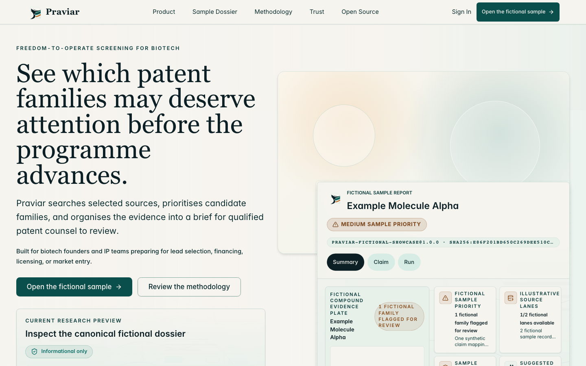

The public-facing entry point explains the evidence-first workflow and opens
the bundled demonstration without an account.

## 2. Sample dossier

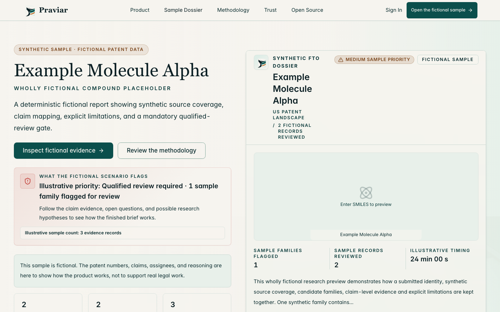

The sample-dossier view introduces scope, evidence limitations, review state,
and the handoff into the working report interface.

## 3. Compound and matter intake

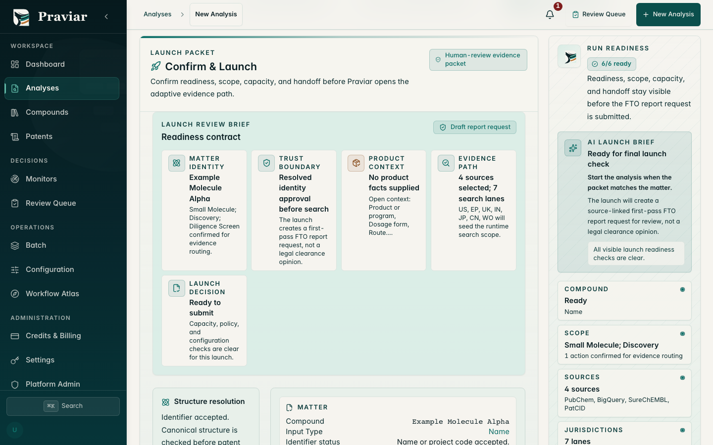

The launch review exposes compound identity, intended product context,
jurisdictions, sources, evidence path, and human checkpoints.

## 4. Mobile intake

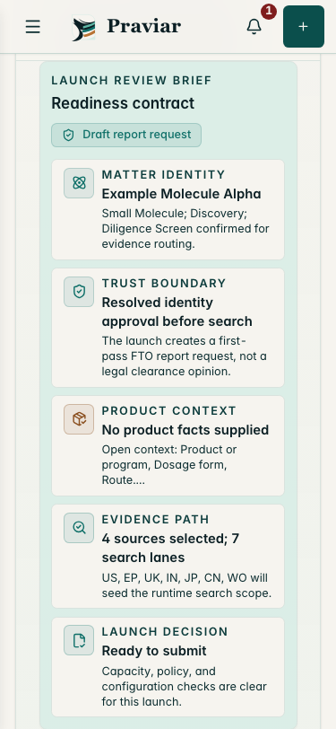

The same readiness contract is available at a 375-pixel mobile viewport.

## 5. Eight-stage analysis progress

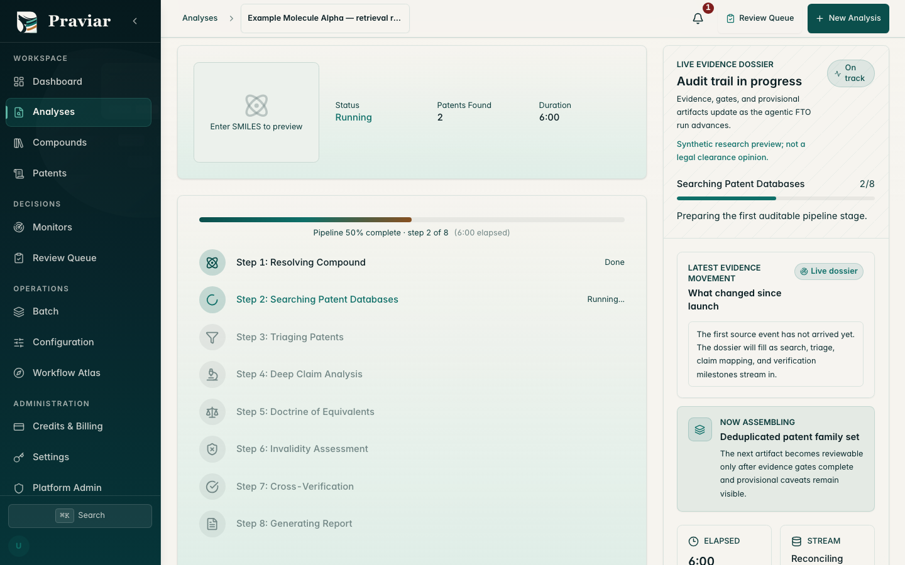

The run-state view exposes stage progress, evidence discovery, provisional
artefacts, and reconciliation instead of collapsing analysis into a spinner.

## 6. Evidence report

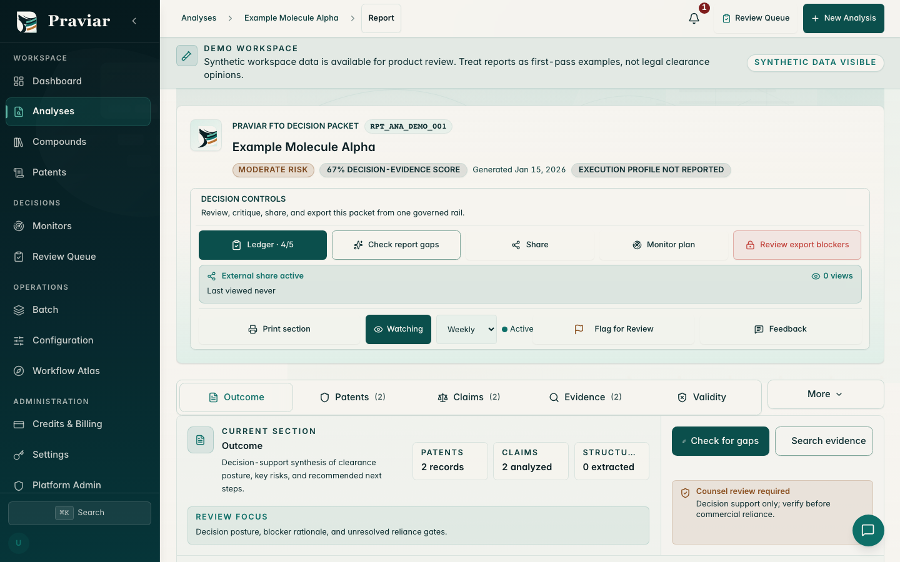

The dossier combines matter scope, patent families, claims, evidence,
uncertainty, review state, watch controls, and export readiness.

## 7. Mobile report

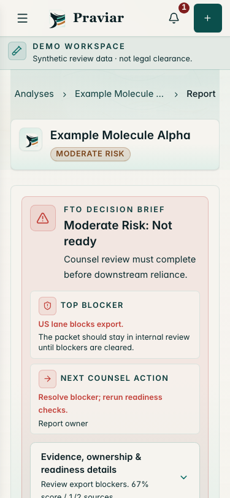

The mobile report keeps the current risk, blocker, next-counsel action, and
evidence boundary visible.

## 8. Claim-evidence matrix

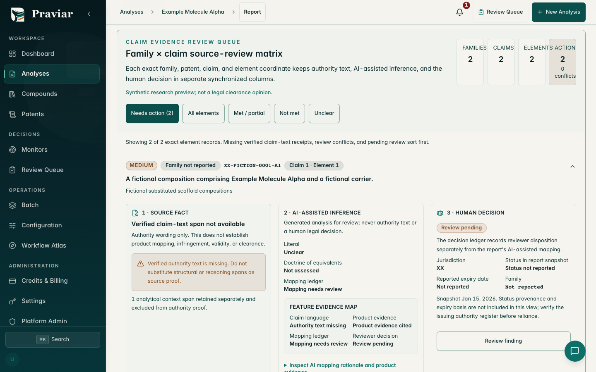

Claim elements are separated into met, not-met, partial, unclear, and
needs-action states with exact evidence and reviewer disposition.

## 9. Citation and source drill-down

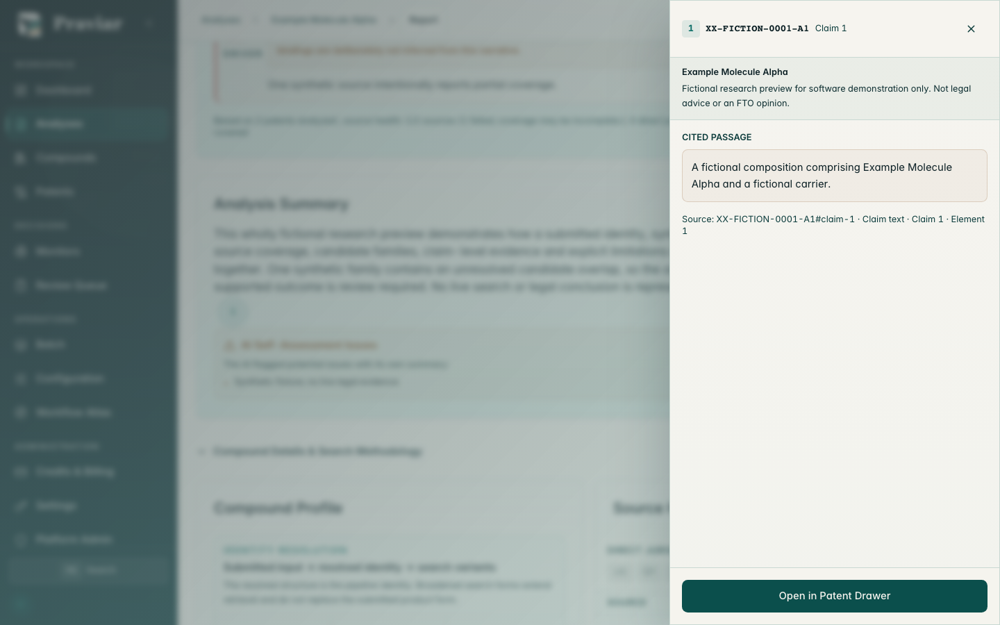

An exact claim element can be opened alongside its supporting passage and
source record.

## 10. Human-review ledger

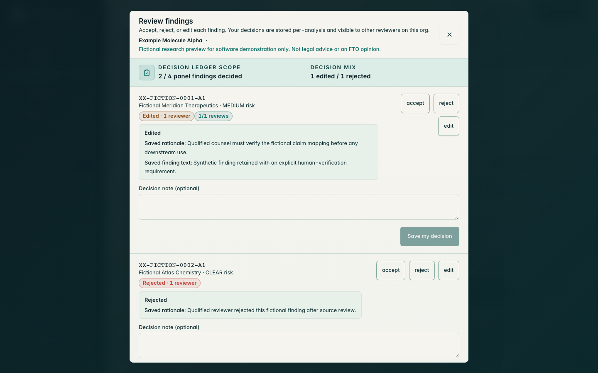

Qualified reviewers can accept, reject, or edit a finding and preserve their
rationale separately from model-assisted analysis.

## 11. Review queue

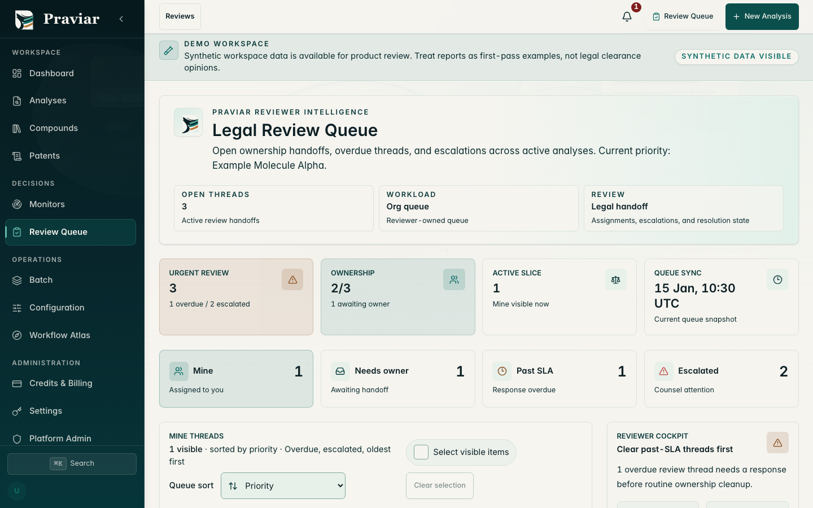

The queue supports ownership, workload, priority, escalation, and matter-level
handoff. Any SLA-like values shown are synthetic interface data, not a service
commitment.

## 12. Fail-closed export

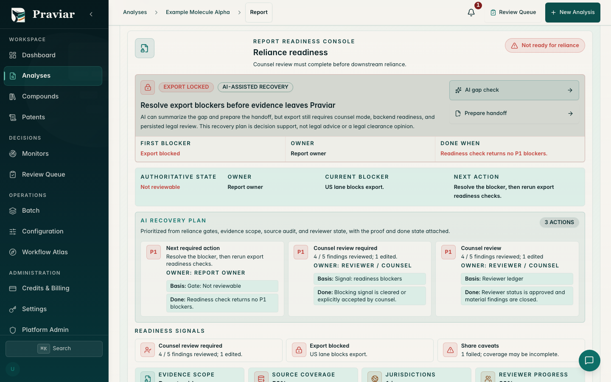

Export is withheld when evidence, source, jurisdiction, or reviewer gates are
not complete.

## 13. Recipient-bound sharing

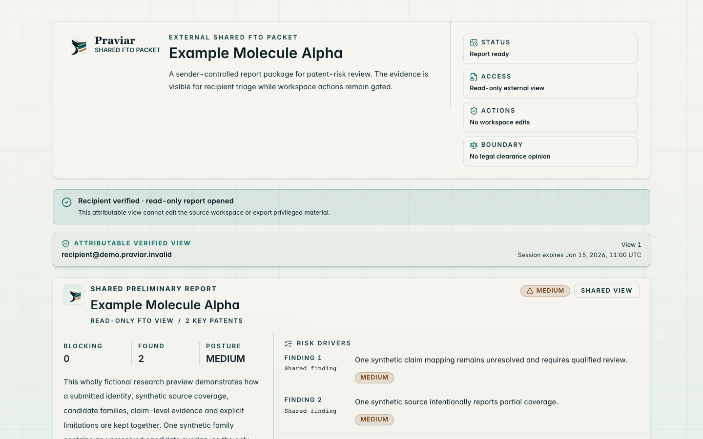

The shared-report surface shows recipient verification, attributable access,
read-only evidence, and the boundary between a preliminary report and a legal
opinion.

## 14. Role-aware workflow map

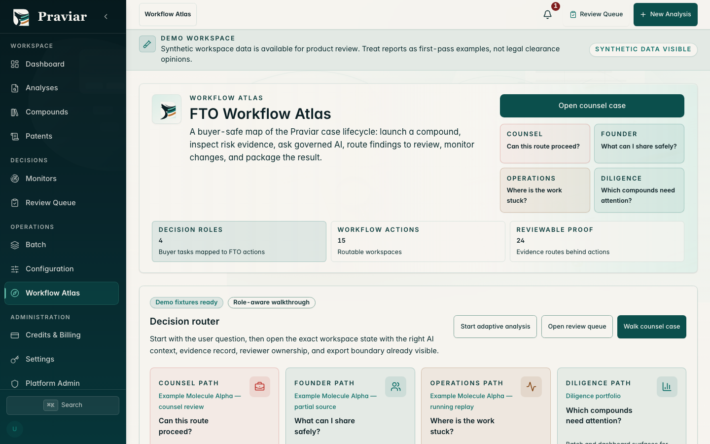

The workflow atlas maps the product to counsel, founder, operations, and
diligence decisions while retaining review boundaries.

Return to the [project README](../../README.md) or continue to the
[compound-to-report pipeline](../PIPELINE.md).
